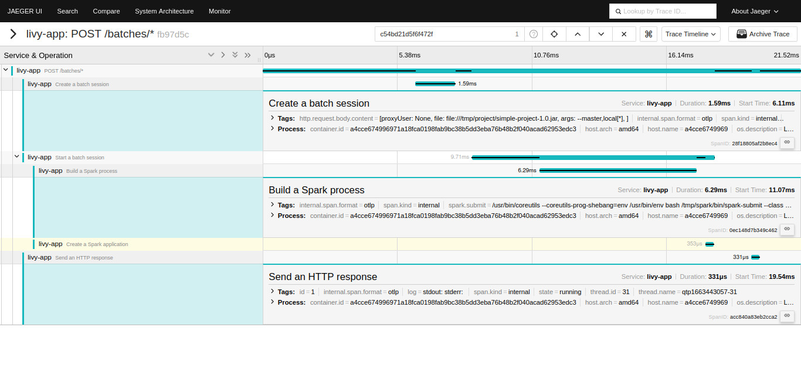
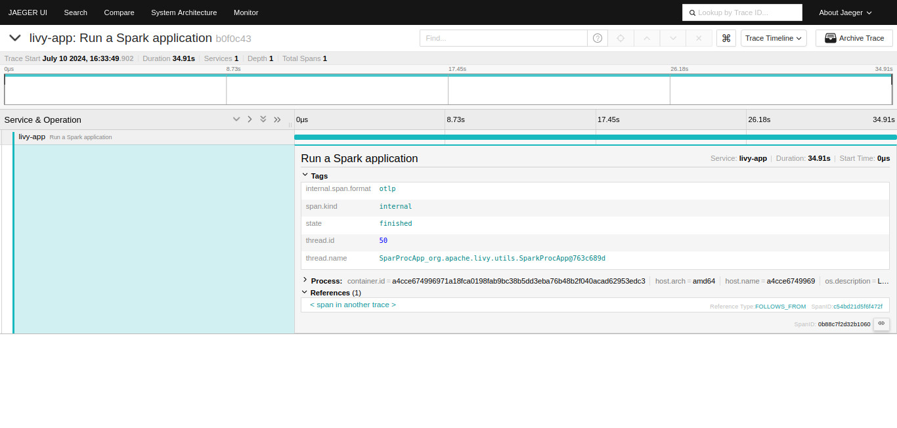

# OpenTelemetry extension for Apache Livy

## Overview

The extension is created to instrument Apache Livy classes to represent the flow of requests.
Current, it provides the following spans and attributes.

```
POST /batches/*
|
+-- Create a batch session
|   - http.request.body.content
|
+-- Start a batch session
|   |
|   +-- Build a Spark process
|   |   - spark.submit
|   |
|   +-- Create a Spark application
|            ¦
|       [Span Link]
|            ¦
|            +-- Run a Spark application
|                - state
|
+-- Send an HTTP response
    - state
    - id
    - log
```




## Build and run

### Build jar only

There is currently no separate flow for only building the extension jar file,
but you can try doing the following:

1. Remove the source code of the Spark application:
   `rm -rf src/main/java/com/gitlab/progxaker/sparkapplication/`.
2. Rename the `pom-extension.xml` file to `pom.xml` to use in the future for `mvn`:
   `mv pom-extension.xml pom.xml`.
3. Package the source code:
   `mvn package`.
4. The result file will be stored in `target/otel-livy-extension-0.8.jar`.

### Build and run an example

To build and run the example application, follow these steps:

1. Build the Docker images and run them using Docker Compose:
   `docker-compose up --build --detach`
2. Send a request using `create-batch.sh`:
   `bash create-batch.sh`
3. Go to Jaeger (http://127.0.0.1:16686/).
4. Select the livy-app service.
5. Click "Find Traces".

To stop and remove containers, networks:  
`docker-compose down`

## Limitations

* Only `POST /batches` requests are captured.
* YARN is not supported.
* Some requests are processed within 1-2 seconds, most ~20 ms.
  I'm not sure if this is related to the extension, but it's necessary to note.

## Inspired by

* https://github.com/keytiong/opentelemetry-spark/
* https://github.com/craigatk/opentelemetry-gradle-plugin
